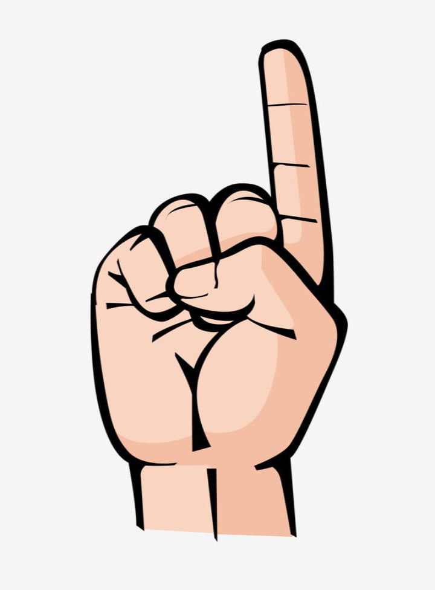

# But

by Tereza "Tess" Koudelková

27 November 2023

- [First Draft](first-draft.md) 
- [Revision](revision.md)
- [Final](index.md) (You Are Here)

## Final

But. The two-sided word blade. Which one it will be is all up to you. You hold the power of the word in your hands (or in this case, mouth).

We use “but” daily, sometimes replacing it with a synonym to prevent its overuse. Based on the context, it can have either a positive or a negative meaning.

Like to hear someone say “but” if it indicates something good for you? Me too! It can change the whole feeling you have about the conversation in that situation.

Imagine planning a trip with your friends, knowing your schedule is tight. There’s so much you need to do. But you also want to go on that trip. So you say, “Hey, I have a lot of stuff going on right now, but I will either postpone it or finish it earlier, so I can join you!”

The positive “but” can have a meaningful impact on our lives and relationships. Ask yourself this question: “Is it necessary?” You really can’t think of anything to support the other? Do you not have any time to change your schedule to make time for your friends? What is going to have a better outcome? Saying, “Oh, sorry, I’d love to go, but I have no time,” or, “Well, I do have a lot of stuff going on but I can reorganize my schedule.”. So, is it necessary to do all that stuff at that time? Of course, sometimes it is. In those other cases? Please, stop hiding behind the word but, and instead, get your time management together.

So, yeah, we like to hear the word “but” in case it indicates something positive. *But* we hate it if it means there’s a catch. It tells us that we won’t like what is about to follow.

The negative “but” also comes in variety of mishaps. We can use it as an attempt to make a situation better. Usually, a weak one and it might go something like this. “I don’t like dogs.“ “I have a dog.“ And then, “Oh! I mean, I usually don’t like dogs, but your dog is super cool!“.

Why is the negative so dangerous? One doesn’t even have to say it out loud. Let’s call this unspoken but a “silent but.“ Even if it isn’t said, we can still “hear“ it in the other’s words. What gives this silent “but“ away is the tone of the speaker’s voice. To recognize the tone of the other helps us to reveal their hidden intentions even if they don’t say them out loud, as the word but.

If “but” doesn’t have an informative meaning in the sentence other than to exclude, as in, “Everyone arrived at the meeting, but the manager wasn’t there.” Be careful how you use it. That goes for all words. Words often do unintended harm if not used with discretion. Even the seemingly simple everyday words we use can sometimes hurt the most.

Tiny words can often cut sharp and deep. So, remember, do use “but“ but carefully.
