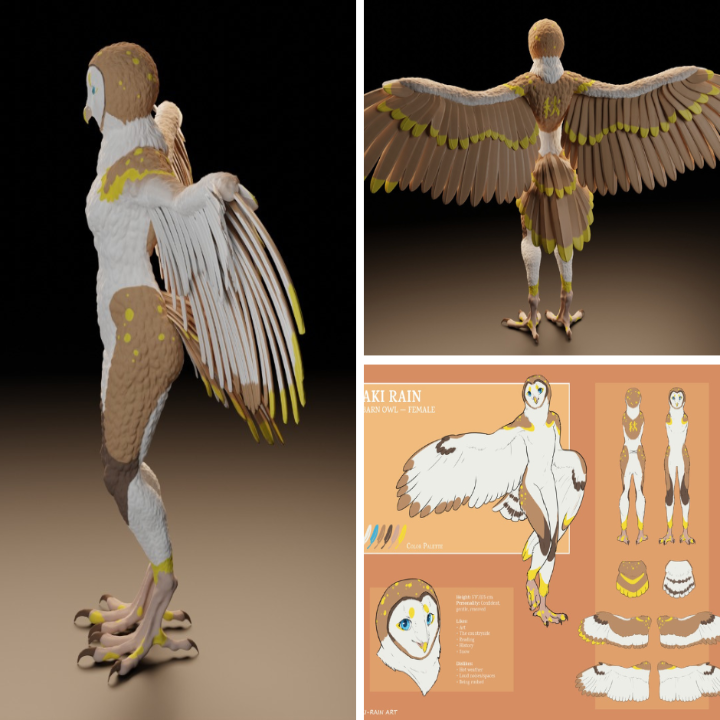
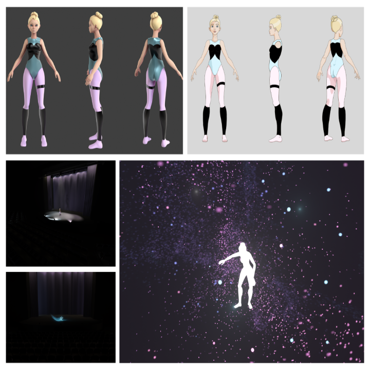

# FIRST IMPRESSION

## About me

TEREZA KOUDELKOVÁ

STORIES – CHARACTERS – GAMES

I am a storyteller with enthusiasm for digital graphics and games. Currently, in the role of a student and a 3D generalist artist. In future, I'd like to focus on immersive storytelling and creation of unique characters for games.

## Featured Projects

### Library

- A 3D interior of a library at night and day, quiet and peaceful place which hides many stories
- very first complex (and completed) environment made in Maya software
- school project for my 1st year finals
- day & night version

### Aki-Rain

- A 3D character sculpt based on the concept of the fursona by the artist of the same name
- school project - exercise
- challenge: working with two different concept arts and marging them together (differed in details)
- sculpting, texture (hand-painted), no retopology and rig (posing)

### [Hidden World](https://youtu.be/mKqspzBNTH8)

- A short animation project on the theme of the “hidden world” – the inner world in which one gets lost when devoted to their passion (dancing)
- school project (2nd year finals)
- a collaboration with my brother (cameras, lighting, music) and one of my best friends (choreography)
- my very first complex animation
- funfact: Showing this project to some people from the animation work field brought up a question if it is a mocap - no, it's not :)

THANK YOU!

See my [presentation](https://www.canva.com/design/DAFzyQPEQXg/Juk2QSs77XM8zXCNxTtVdQ/view?utm_content=DAFzyQPEQXg&utm_campaign=designshare&utm_medium=link&utm_source=editor)
