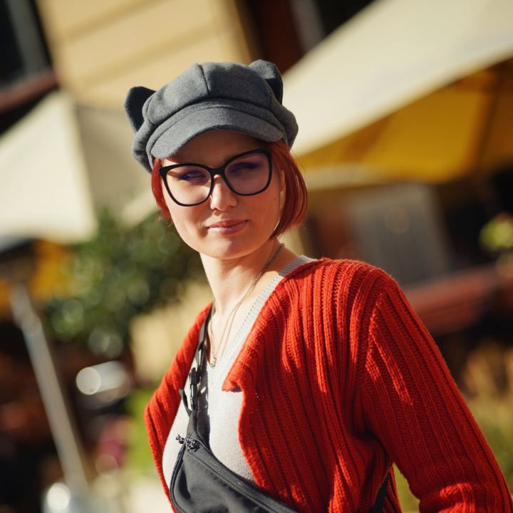
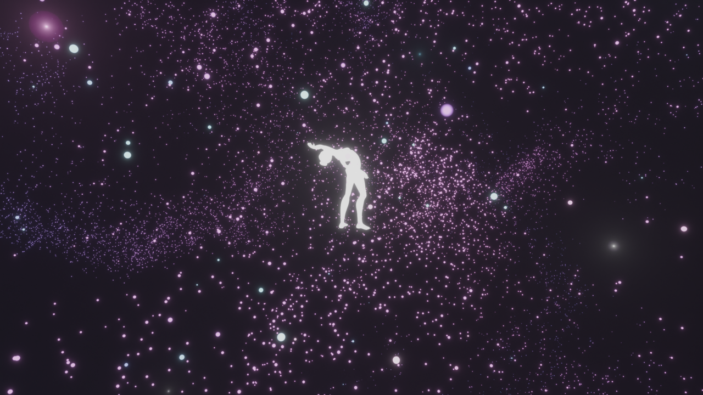
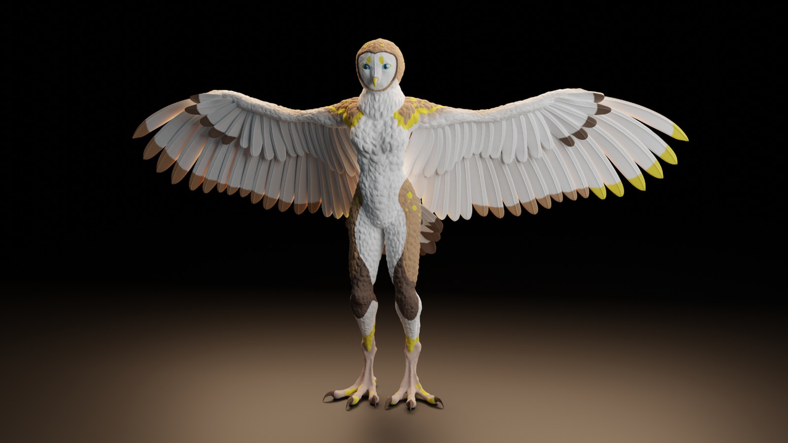
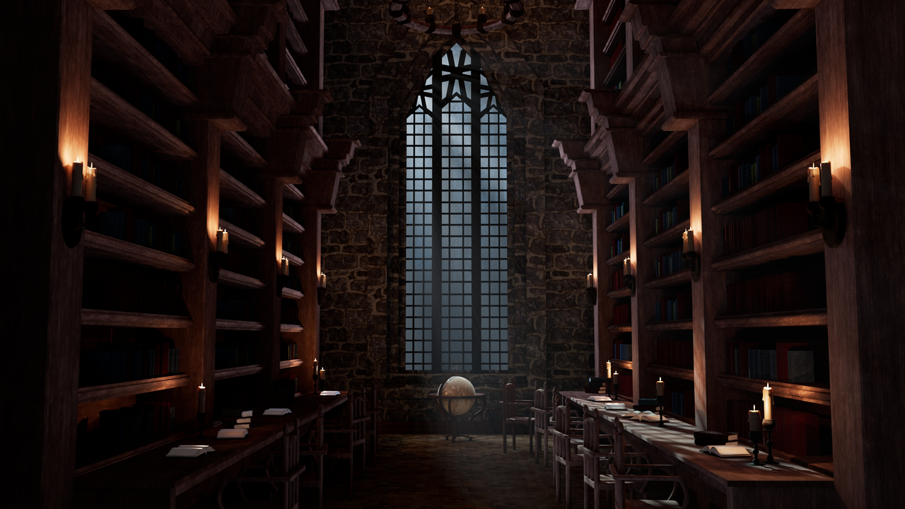
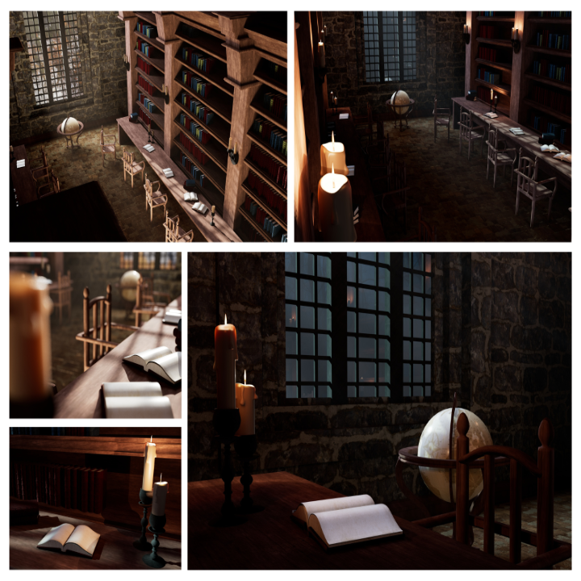

# FIRST IMPRESSION - DRAFT

## My Story
Hi, I'm Tereza "Tess" Koudelková

STORIES – CHARACTERS – GAMES

I am here to tell immersive stories about unique characters.

It actually took me some time to realize this. I've always been a storyteller with enthusiasm for games. My vivid imagination and desire to show my stories in a visual form brought me to digital graphics. So, here I am, currently in the role of a student and a 3D generalist artist with aim to focus on storytelling and games.

I thought I've always knew what I wanted. It might have changed in time, but I always came back to stories.

I started as a book lover and an amateur writer. My passion for language took me to study literature on high school. Since the very first year, I wanted to get to a publishing house. Somewhen around the third year, I discovered 3D graphics, and it led me here. Soon, I decided that I'd like to focus on character creation. As my time at the university comes to its end, I realize, that I might want to take another step forward.

I came from a very different world of words to discover the world of digital graphics. My love for games aimes me that way, but I've never stopped telling stories.

## What Else Fills My Heart With Passion
When I'm trying not to drown in responsibilities, I'm probably:
- enjoying a good book (Fantasy or sci-fi? Bring it!),
- worldbuilding vast worlds and planning my own stories (writing, writing, writing),
- redesigning my blog for the thousand time (should probably do it again),
- trying to save my awesome players from themselves as a DM (Why? Just, why?),
- playing games (both board and video),
- and many more!

*Oh!* And you can always find me listening to music (I love *Nightcore*, just by the way!).

## Digital Graphic Projects
In the field of digital graphics, I focus mainly on 3D with which I'd like to achieve a photorealism, yet because of time, it's not always possible. Before I even started with 3D, I used to do some 2D digital graphics such as book covers for my stories, or web layouts just for fun. And I still make some, once in a while!

### [Hidden World](https://youtu.be/mKqspzBNTH8)

This short animation was made for the 2nd year final exams of my studies at univeristy. We were given the theme "hidden world" which I decided to depict as the inner world in which one gets lost when devoted to their passion, in this case, dancing. This project was a collaboration since the very beginning. When I knew the story, I asked my brother to compose a music for it (and he also helped me with the lighting and cameras), and my friend to come up with a choreography. Then, I just did the rest: modeling, sculpting, texturing, rigging, animation.

It was my first complex animation that I was working on. And I have a small funfact about it: I did show this project to some people from the animation work of field and it actually brought up a question if it is a mocap – no, it's not :D

### Aki-Rain

I made this sculpt of a character as a character creation exercise during school lessons. It is based on the concept of the fursona called Aki-Rain by the artist of the same nickname, and it was actually very challenging because I worked with two different concept arts of the character. They differed only in details but still it was a challenge to merge them together into one.

I did the sculpting and texturing (hand-painted). And I would like to go back to it one day to finish the retopology and rigging to properly pose the character.

### Library

This 3D interior of a library, quiet and peaceful place which hides many stories was the very first complex (and completed) environment I've ever made. It was created in Maya in two versions (day & night), and the process included modeling, UV editing, texturing, lighting and rendering.

This project was challenging on its own as I learned the software during the process of making it. 

## What's Next...?
In the long term, I work on a few personal storytelling/digital graphics projects I can't yet share, but if you like my work and want to see what will come in the future, feel free to stay tuned!

THANK YOU!
