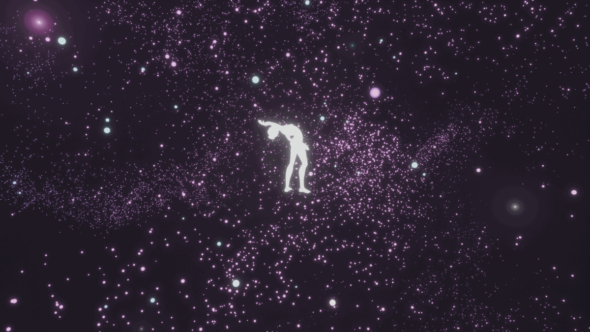
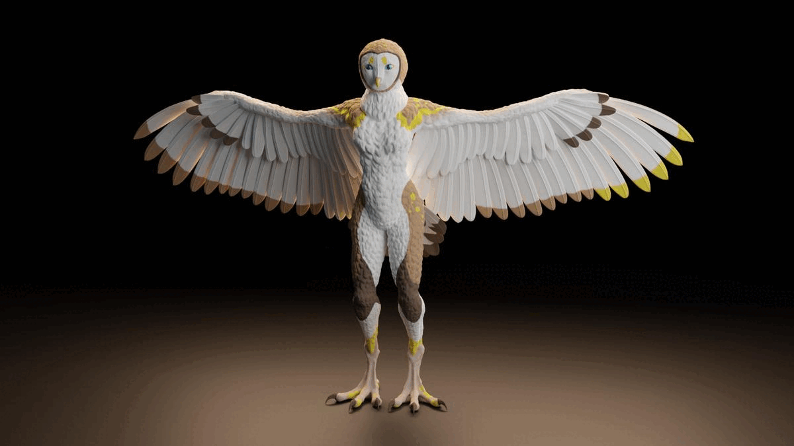
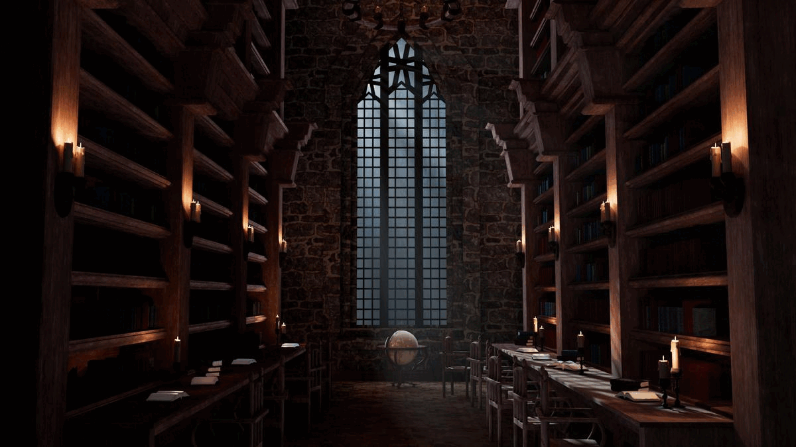

# My Work

In the field of digital graphics, I focus mainly on 3D with which I'd like to achieve a photorealism, yet because of time, it's not always possible. Before I even started with 3D, I used to do some 2D digital graphics such as book covers for my stories, or web layouts just for fun. And I still make some, once in a while!

## Hidden World (Animation)

This 1 minute animation was made in 5 months as the final project for the 2nd year final exams of my studies. It is based on the theme of the "hidden world" which I decided to depict as the inner world in which one gets lost when devoted to their passion, in this case, dancing. This project was a collaboration since the very beginning. When I knew the story, I asked my brother to compose a music for it (and he also helped me with the lighting and cameras), and my friend to come up with a choreography. Then, I did the rest: modeling, sculpting, texturing, rigging, animation.

The whole project was made in Blender.

It was my first complex animation that I was working on. And I have a small fun fact about it: I showed this project to a few people in the industry and it brought up a question if it is a motion capture – no, it's not :D

## Aki-Rain Fursona (Character Sculpt)

Aki Rain I made this sculpt of a character as a character creation exercise during school lessons. It is based on the concept of the fursona called [Aki-Rain](https://www.furaffinity.net/user/aki-rain/) by the artist of the same nickname. The project was and was quite challenging because I worked with two different concept arts of the character. They differed only in details but still it was a challenge to merge them together into one.

I did the sculpting and texturing (hand-painted) all in Blender, and I would like to go back to it one day to finish the retopology and rigging to properly pose the character.

## Hogwarts Inspired Library (Environment)

Library Night Library Project Images Collage

This 3D interior of a library, quiet and peaceful place which hides many stories was the very first complex (and completed) environment I've ever made. It was created in Maya in two versions (day & night), and the process included modeling, UV editing, texturing, lighting and rendering.

Even if this was actually the very first time I worked in Maya software, I am very happy with the result.

## What's Next...?

In the long term, I work on a few personal storytelling/digital graphics projects I can't yet share, but if you like my work and want to see what will come in the future, feel free to stay tuned!
